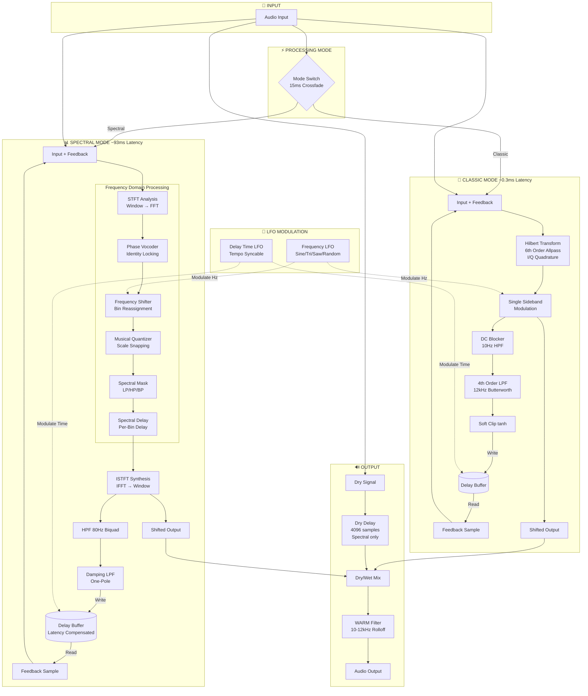

# Frequency Shifter Plugin Architecture

## Overview

This document describes the signal flow and architecture of the Harmonic-Preserving Frequency Shifter VST3/AU plugin.

## Architecture Diagram



## Detailed Signal Flow

### Classic Mode (Hilbert Transform)

```
┌─────────────────────────────────────────────────────────────────────────┐
│                         CLASSIC MODE SIGNAL FLOW                         │
├─────────────────────────────────────────────────────────────────────────┤
│                                                                          │
│  Input ──┬──► (+) ──► Hilbert Transform ──► SSB Modulation ──► Output   │
│          │    ▲                                    │                     │
│          │    │                                    ▼                     │
│          │    │                            DC Blocker (10Hz)             │
│          │    │                                    │                     │
│          │    │                            4th Order LPF (12kHz)         │
│          │    │                                    │                     │
│          │    │                            Soft Clip (tanh)              │
│          │    │                                    │                     │
│          │    └──────── Delay Buffer ◄────────────┘                     │
│          │              (read)         (write)                           │
│          │                                                               │
│          └──────────────────────────────────────────────────► Dry Path  │
│                                                                          │
└─────────────────────────────────────────────────────────────────────────┘
```

**Key characteristics:**
- **Latency:** ~12 samples (~0.3ms at 44.1kHz)
- **Feedback:** Read from buffer → add to input → process → filter → write to buffer
- **Filtering:** Eventide-style DC block + 4th order Butterworth LPF + soft clip

### Spectral Mode (FFT-based)

```
┌─────────────────────────────────────────────────────────────────────────┐
│                        SPECTRAL MODE SIGNAL FLOW                         │
├─────────────────────────────────────────────────────────────────────────┤
│                                                                          │
│  Input ──┬──► (+) ──► STFT ──► [Frequency Domain Chain] ──► ISTFT ──► Out│
│          │    ▲                                               │          │
│          │    │                                               ▼          │
│          │    │                                        HPF (80Hz)        │
│          │    │                                               │          │
│          │    │                                        Damping LPF       │
│          │    │                                               │          │
│          │    └───────── Delay Buffer ◄──────────────────────┘          │
│          │    (latency   (read)                    (write)               │
│          │    compensated)                                               │
│          │                                                               │
│          └───► Dry Delay (4096 samples) ─────────────────────► Dry Path │
│                                                                          │
├─────────────────────────────────────────────────────────────────────────┤
│                      FREQUENCY DOMAIN CHAIN                              │
│  ┌──────────┐   ┌─────────┐   ┌──────────┐   ┌──────┐   ┌────────────┐  │
│  │ Phase    │──►│ Freq    │──►│ Musical  │──►│ Spec │──►│ Spectral   │  │
│  │ Vocoder  │   │ Shifter │   │ Quantizer│   │ Mask │   │ Delay      │  │
│  └──────────┘   └─────────┘   └──────────┘   └──────┘   └────────────┘  │
│                                                                          │
└─────────────────────────────────────────────────────────────────────────┘
```

**Key characteristics:**
- **Latency:** 4096 samples (~93ms at 44.1kHz)
- **Feedback:** Time-domain buffer (post-ISTFT), latency-compensated read
- **Spectral Delay:** Operates in frequency domain on magnitude/phase bins
- **Dry alignment:** Dry signal delayed by MAX_FFT_SIZE to match wet

## Key Components

| Component | File | Purpose |
|-----------|------|---------|
| HilbertShifter | `dsp/HilbertShifter.h` | Allpass-based I/Q generation + SSB modulation |
| STFT | `dsp/STFT.h` | Windowed FFT analysis/synthesis (Hann window) |
| PhaseVocoder | `dsp/PhaseVocoder.h` | Laroche & Dolson identity phase locking |
| FrequencyShifter | `dsp/FrequencyShifter.h` | Linear frequency bin reassignment |
| MusicalQuantizer | `dsp/MusicalQuantizer.cpp` | Scale snapping with envelope preservation |
| SpectralDelay | `dsp/SpectralDelay.h` | Per-bin frequency-domain delay |
| SpectralMask | `dsp/SpectralMask.h` | Frequency-selective wet/dry blending |

## Feedback Architecture

Both modes share the same feedback concept: **feedback routes back to the INPUT**, creating cascading pitch shifts (barber-pole effect). Each delay repeat gets shifted again.

### Classic Mode Feedback Chain
1. **Read** from delay buffer (raw delay time, no compensation)
2. **Add** to input sample
3. **Process** through Hilbert → SSB
4. **Filter** output: DC Block → 4th Order LPF (12kHz) → Soft Clip
5. **Write** filtered output to delay buffer

### Spectral Mode Feedback Chain
1. **Read** from delay buffer (delay time - FFT latency for compensation)
2. **Add** to input sample
3. **Process** through STFT → [freq domain chain] → ISTFT
4. **Filter** ISTFT output: HPF (80Hz) → Damping LPF
5. **Write** filtered output to delay buffer

## LFO Modulation

Two independent LFOs with tempo sync:

| LFO | Target | Range | Notes |
|-----|--------|-------|-------|
| Frequency LFO | Shift amount | ±5000 Hz or degrees | Latency-compensated phase |
| Delay Time LFO | Delay time | ±1000 ms | Creates dub/tape wobble |

**Shapes:** Sine, Triangle, Saw, Inverse Saw, Random (Sample & Hold)

## FFT Size Control (SMEAR)

| FFT Size | Latency (44.1kHz) | Resolution | SMEAR Range |
|----------|-------------------|------------|-------------|
| 256 | ~5.8ms | Low | 5-8.7ms |
| 512 | ~11.6ms | | 8.7-17.4ms |
| 1024 | ~23.2ms | | 17.4-34.8ms |
| 2048 | ~46.4ms | | 34.8-69.6ms |
| 4096 | ~92.9ms | High | 69.6-123ms |

**Note:** Reported latency is always MAX_FFT_SIZE (4096) regardless of SMEAR setting.

## Mode Switching

15ms equal-power crossfade:
- Both pipelines run during transition
- Sine/cosine gains for smooth blend
- Latency updated after completion
